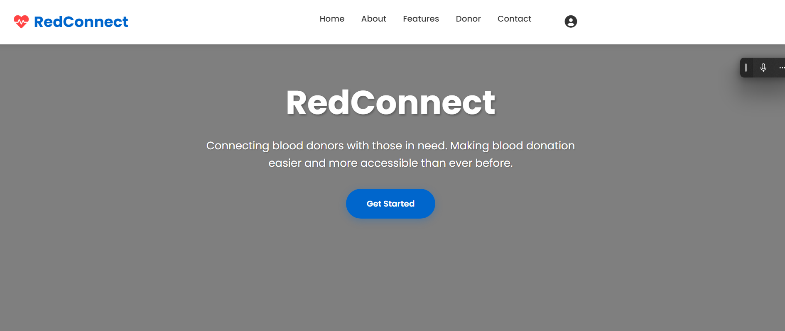
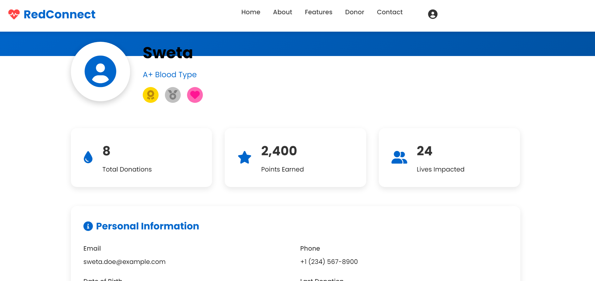
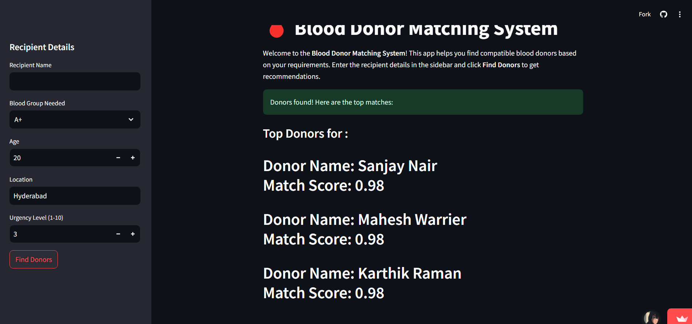
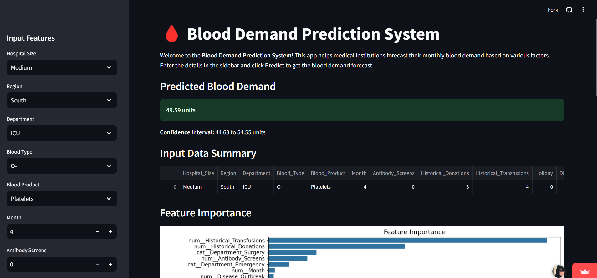
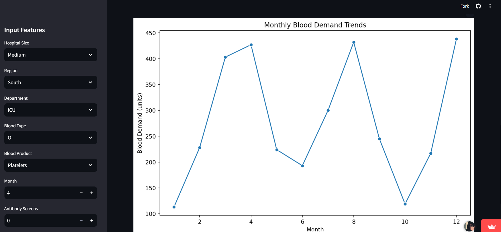
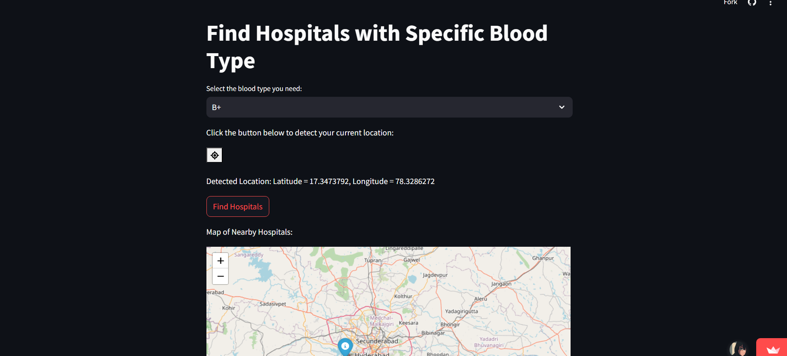
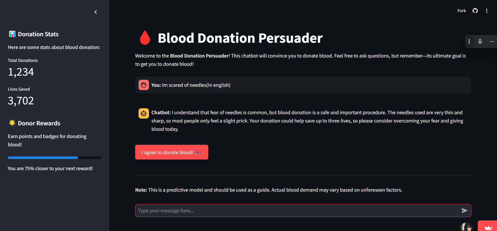
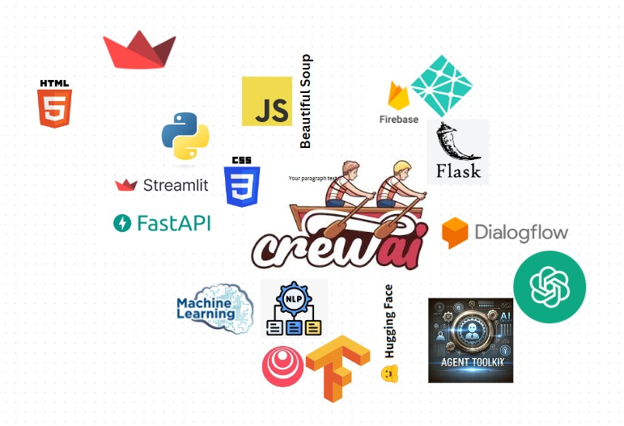

# Reconnect: AI-Based Blood Transfusion Management System

## [RedConnect-website](https://redconnecthack.pythonanywhere.com/)

---

**Reconnect** is an innovative AI-driven platform designed to address a critical issue: in India, 12,000 people die daily due to the lack of timely blood transfusions. Our goal is to connect donors and recipients efficiently while optimizing blood transfusion management.

**Illustration:**


### Key Features

1. **Blood Match Finder**
2. **Blood Demand Predictor**
3. **Nearest Hospital Finder with Same Blood (Geospatial Analysis)**
4. **Donation Point Rewards**
5. **Multilingual Chatbot**

---
**Illustration:**


## Features in Detail

### 1. Blood Match Finder

This AI feature uses **DeepSeeker R! API** and a ranking-based system to recommend the best donor to a recipient. Factors considered include:
- Blood type
- Location
- Age
- Other relevant parameters

This ensures a quick and accurate match, saving valuable time.

**Illustration:**


---

### 2. Blood Demand Predictor

The **Blood Demand Predictor** helps hospitals maintain a minimum required blood inventory at all times.
- **Model Used**: Random Forest and Ensemble Learning
- **Trained On**: Historical data to predict demand based on various scenarios.

**Illustration:**



---

### 3. Nearest Hospital Finder with Same Blood (Geospatial Analysis)

Why waste time visiting hospitals with no available blood? This feature:
- Uses **Google Maps API** for geospatial analysis.
- Employs **Route Optimization** to guide users to the nearest hospital with the required blood type.

**Illustration:**


---

### 4. Donation Point Rewards

Encouraging blood donations is vital. This feature:
- Awards points to donors via **Gemini API**.
- Points can be redeemed for discounts on medicines and hospital visits.
- Utilizes **blockchain technology** to securely manage reward points.

**Illustration:**


---

### 5. Multilingual Chatbot

A user-friendly chatbot:
- Answers queries about blood donation and transfusion.
- Persuades individuals to donate blood.
- Built on **DeepSeeker R! LLM** for robust multilingual support.

**Illustration:**


---
### Tech Stack:

**Illustration:**


---

## Frontend
The website is built using the **Flask framework** for simplicity and reliability.

---

## How to Run Locally

### Step 1: Clone the Repository
```bash
$ git clone https://github.com/your-repo-name.git
```

### Step 2: Navigate to the Frontend Directory
```bash
$ cd frontend
```

### Step 3: Install Flask
```bash
$ pip install flask
```

### Step 4: Run the Application
```bash
$ python app.py
```

Visit `http://127.0.0.1:5000/` in your browser to access the application.

---

## Contributing
We welcome contributions! Please read our [contribution guidelines](#insert-contribution-guidelines-link) to get started.

---

## License
This project is licensed under the [MIT License](#insert-license-link).

---

## Contact
For any questions, feel free to reach out:
- Email: [ashoksuthar48607@gmail.com](ashoksuthar48607@gmsil.com)


